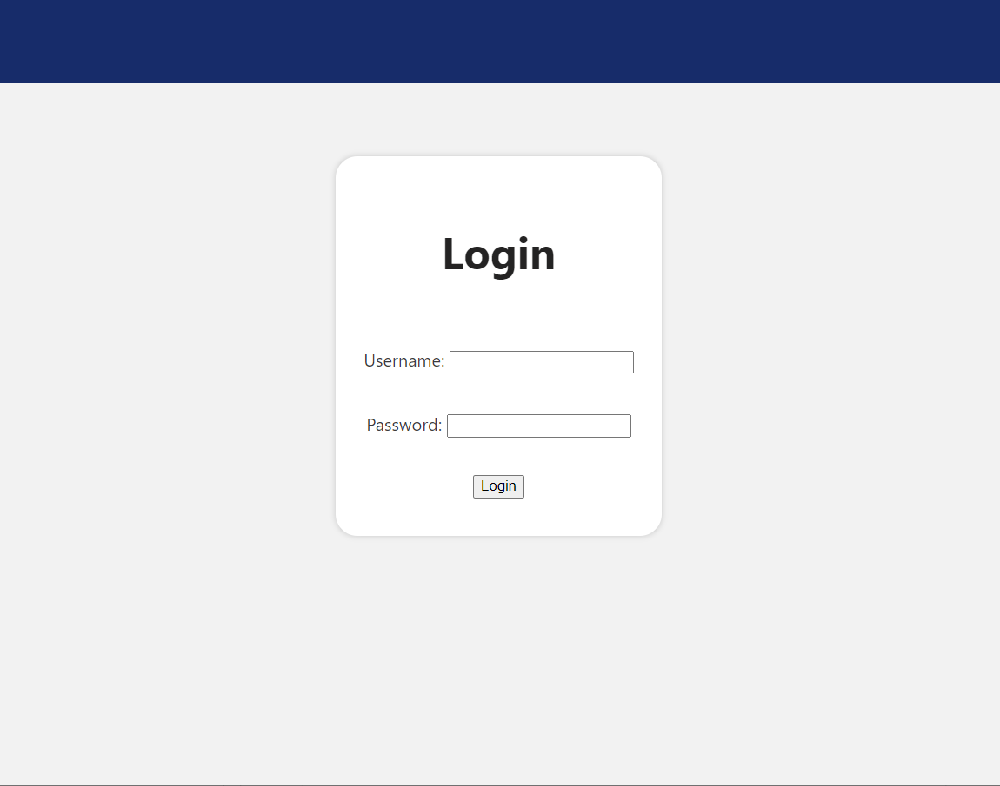
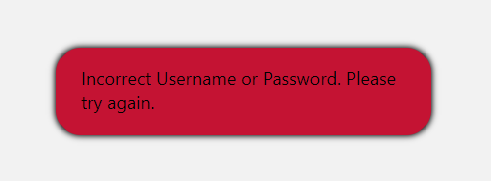
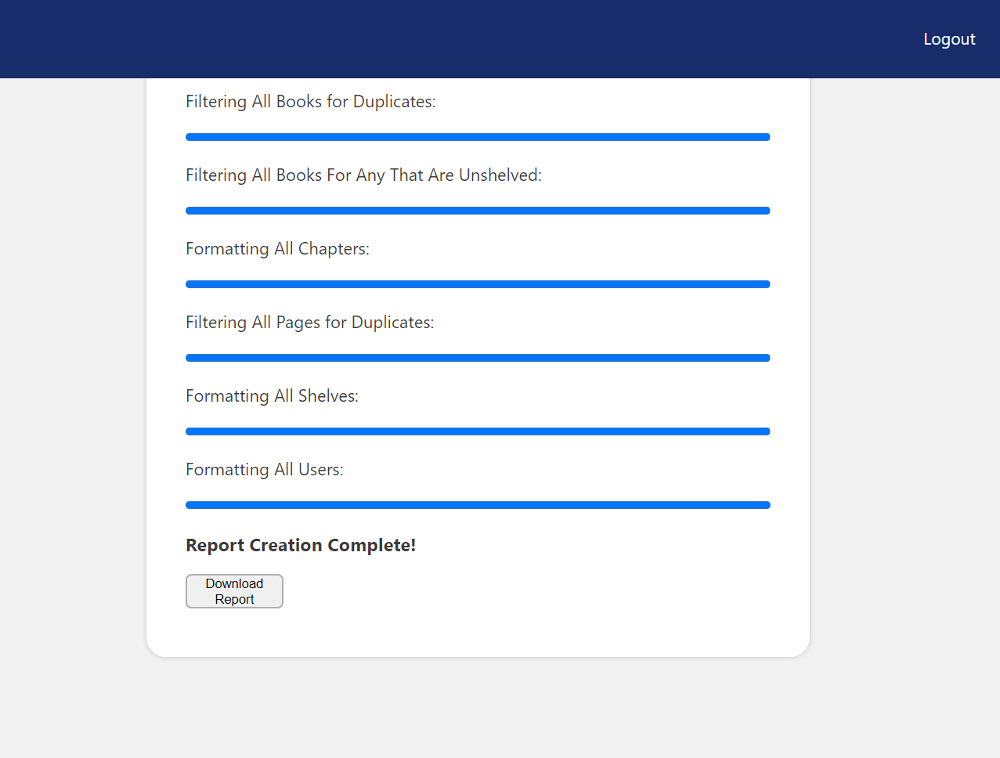

# Library Reporter
The Library Reporter was originally a command-line tool but has since been modified into a webpage, designed in Python 3.12.4 to interact directly with a Bookstack Library API. It provides a range of reports that it will produce after it fetches, retrieves, processes, and formats the API data. These reports are then combined into one user-friendly excel output.

## Installation
#### Python 3.12.4 is required to run this webpage. You can find the download link [here.](https://www.python.org/downloads/)
#### This project uses the following Python libraries to perform its operations:<br/>
Libraries that are included in the Python standard library:
<pre>
-   os
-   datetime
-   asyncio
-   time
-   base64
-   json
</pre>
Libraries that need to be manually installed:
<pre>
-   requests
-   pandas
-   openpyxl
-   aiohttp
-   dotenv
-   flask
</pre>

To install these manually, run:<br/> 
```bash
pip install requests pandas openpyxl aiohttp python-dotenv flask
```
#### Environment Variables
Before running the reporter locally, you'll need to manually create a .env file that holds your API keys to the Bookstack Library API your working with and username/password authentication. To start, create this .env file in the same directory level as the script (bixal-bookstack-cli.py file). Then after this file is created, copy and paste the following code snippet:
```
# API keys
TOKEN_ID=YOUR_TOKEN_ID_HERE
TOKEN_SECRET=YOUR_TOKEN_SECRET_HERE
USER_NAME=YOUR_USERNAME_HERE
PASSWORD=YOUR_PASSWORD_HERE
PORT=YOUR_PORT_NUMBER_HERE
APP_SECRET_KEY=YOUR_APP_SECRET_KEY_HERE
```
Finally, copy and paste your Token ID, Token Secret keys, Username, Password, Port Number, and App Secret Key to their appropriate **environment** variables. 

Make sure to also copy and paste these same variables into their appropriate enviornment variables on the server.

## Usage

To use the reporter run:
```python
flask --app flask-library-reporter run -p 80
```

Upon running the script, you can now view the webpage by visiting the url displayed in the terminal from which you ran the command.

Next, the webpage will direct you to the login screen for authentication:



Type a valid username and password to access the reporting functionalty. If an input is invalid, you will be notified at the bottom of the login form with the following:



<br>

### Homepage
Once authenticated, you will see the homepage and have access to run the reporter. You will see a title and a description followed by a button to run the reports! If said button is pressed, then you will be shown progess bars of all steps of the reporting process. 

When everything is complete, you will see an additional download button at the bottom of progress bars:



This button will download the multi-sheet excel file to your via your browser for you to view and use.